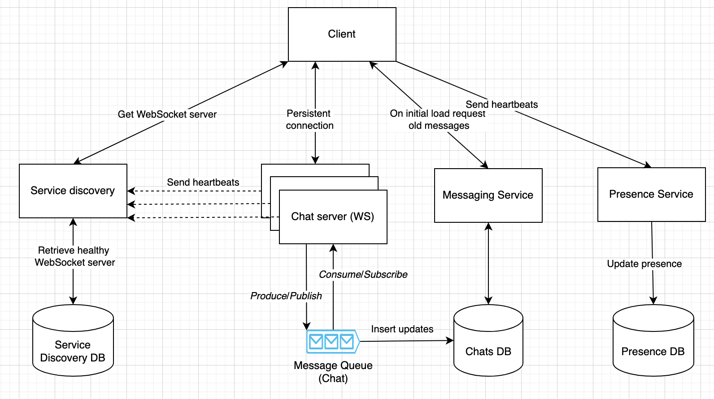
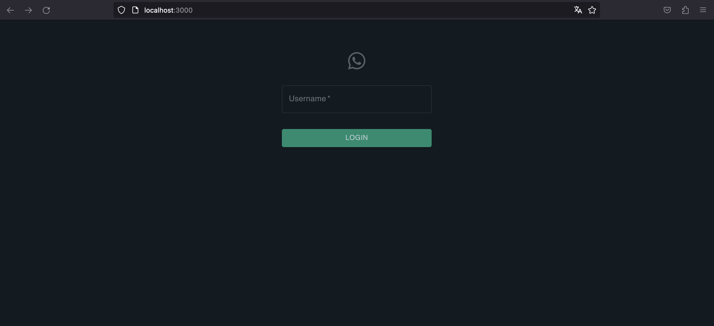
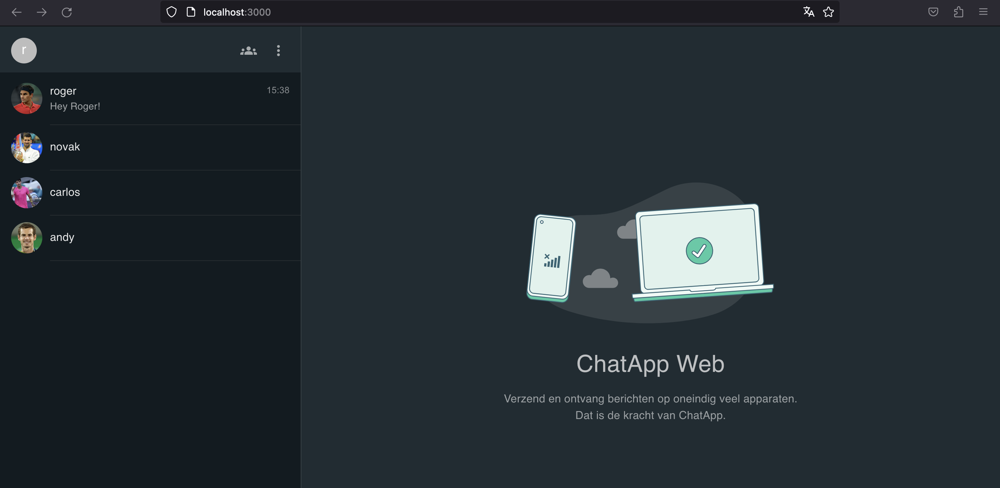
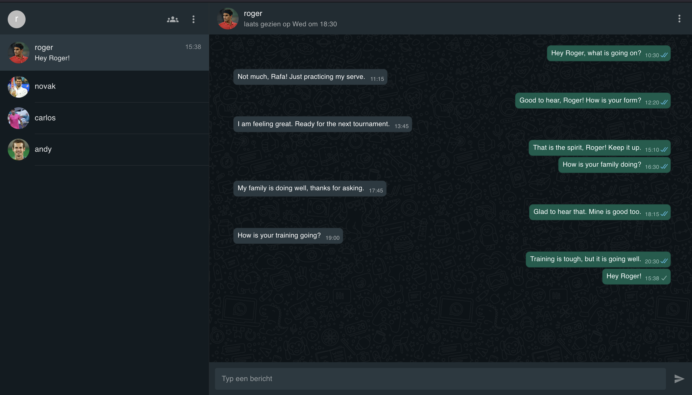
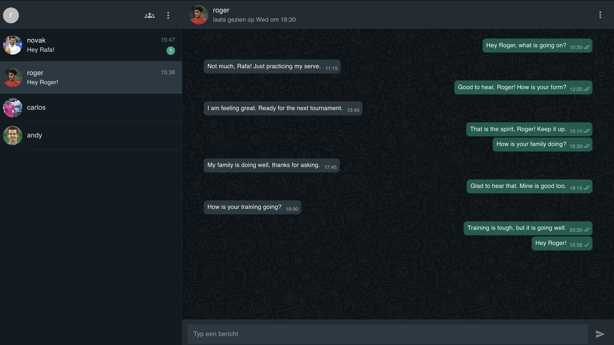

# Building a Scalable Chat Application

**Why It Matters**

In a world where chat applications like WhatsApp became the primary sources of communication, ensuring reliability and availability of these systems is very critical. Take for instance the WhatsApp outage in October 2022, which affected 2 billion users world-wide ([source](https://www.livemint.com/news/world/whatsapp-down-top-5-outages-that-disrupted-the-world-11666687792717.html)). 


From the perspective of a software engineer, the challenge of designing a chat application that is not only robust but can also handle the demands of a growing user base is interesting. The book "System Design Interview" by Alex Xu describes high-level concepts for solving problems of these large-scale chat systems, inspiring me to investigate a chat application with scalability at its core.

I will define our project's scope and requirements, sketch out a high-level system design, build a working prototype, and finally, present potential bottlenecks and strategies to solve these issues.

**Disclaimer**

Before going into technical details, it is important to note that the application I developed is best suited for prototyping purposes. It lacks data validation and other features that are required for production environments.

## Scope

In this project I focus on the core components required for a functional prototype of a simple chat system. It is not my goal to create advanced features for the end users, but instead focus more on availability and scalability of the whole system.

**Functional requirements**

- 1-to-1 chats.
- Multi-device support, letting users chat across different (web)platforms, including multiple tabs on the same computer.
- Message sending and receiving, along with read receipts.
- A user-friendly interface for viewing recent chats, similar to WhatsApp.
- Real-time tracking of user online/offline status.
- Storing and updating chat messages.

******************************************************Non-functional requirements******************************************************

- High performance with minimal latency.
- Reliability.
- High availability, ensuring a good chat experience.
- Scalability that can effortlessly tackle increasing system load.

## Technical design

Building a scalable chat application involves a set of design and technological choices. In this chapter, I will discuss each component in our architecture that addresses the core challenges of scalability and real-time communication.

### Technical Architecture




Our technical architecture is a set of interconnected components, each playing a crucial role in creating the chat application:

- **Client**: The frontend application is accessible in the user's browser.
- **Chat Server (WS)**: This service establishes a bidirectional channel for communication between users, enabling real-time chats.
- **Service Discovery**: A service responsible for routing users to available WebSocket servers, ensuring load balancing.
- **Service Discovery DB**: This database maintains the status of different WebSocket servers, indicating whether they are online, offline, or deleted.
- **Message Queue (Chats)**: Messages are added to queues, allowing for fanout and ensuring multiple clients can receive the same message.
- **Messaging Service**: This service fetches old messages on a page reload.
- **Chats DB**: All messages are stored in a Cassandra key-value database.
- **Presence Service**: Users receive real-time updates on the online and last seen status of others.
- **Presence DB**: The status of each user is stored in a Cassandra database.

### A functional chat
I started with creating a simple UI, the **************Client************** service, which establishes connections with other users via the ********************WebSocket******************** service. These two essential components form the foundation of the chat application, facilitating user-to-user communication. For prototyping, I chose React due to its familiarity and the speed it offers for building interfaces. However, it is important to note that the Create React App (CRA) framework has been discontinued since the start of 2023, and it might be smart to explore alternatives like *Vite*.

WebSockets emerged as the communication method of choice. Their persistent, bidirectional connection enables efficient data exchange between clients and the server. While various WebSocket libraries exist, I opted for the native JavaScript WebSocket module for simplicity. One drawback of the native approach is the absence of automatic reconnection to the WebSocket server. As a solution, the client attempts to reconnect every 1000ms when the connection is lost.

### Scaling WebSockets
However, a single WebSocket is not sufficient for serving millions of users. This would put much stress on the WebSocket server and result in a Single Point Of Failure (SPOF), where server downtime could disrupt the entire service. To address this, I developed the **Service Discovery** service, responsible for distributing the user load across multiple WebSocket servers. 

For our prototype, I used a round-robin approach to balance the load among WebSocket servers. If we have three WebSocket servers, client1 connects to socket1, client2 to socket2, and so on. This simplistic approach, while easy to implement, has its shortcomings. For example, it might lead to uneven workloads, with some connections being more active, resulting in hot partitions. Scaling up or down can also introduce problems. More on this topic is discussed in the chapter “Bottlenecks”.

### Monitoring WebSocket servers
WebSocket servers can go down, making it crucial to avoid routing users to inactive servers. To tackle this challenge, the **Service Discovery DB** is created, a key-value store tracking the status of each server. Instead of directly checking server status in the Service Discovery service, the gossip protocol is implemented. In this protocol, every WebSocket server sends heartbeats at regular intervals to a random set of WebSocket servers. These servers maintain an internal data structure to track the received heartbeats. Periodically, each WebSocket server checks the latest heartbeat timestamp from the servers it received heartbeats from. If this timestamp exceeds a certain threshold (e.g., 30000ms), the WebSocket server contacts other servers to determine if the server is genuinely offline. If no other servers confirm activity, the server is considered down.

### Message queues
Now that we have successfully scaled our WebSockets, a new challenge arises - how do clients communicate when they might be connected to different WebSocket servers? This led to the introduction of a **Message Queue**. All messages are routed to this queue and distributed accordingly. In our prototype, I chose to use RabbitMQ, a queuing technology highlighted in the System Design book. Additionally, I found it straightforward to implement a running RabbitMQ cluster with NodeJS. (TODO: add picture of message flow user A to user B)

It is essential to distinguish the terminologies of a "client" and a "user." A "client" refers to an user visiting the website, and a user could have multiple clients, such as in the case of multiple browser tabs. The system operates as follows when an user connects:

- Every user has a personal queue, e.g., `{user}-messages`, where messages are sent to. If the queue does not exist, it is created on connection.
- Since one user might have multiple clients, each client has a personal queue, e.g., `{user}-{uuid}-messages`, with a unique identifier (UUID) to distinguish between different client (e.g., an user has multiple tabs open in their browser). This id is created on the client-side.
- All messages sent to `{user}-messages` are fanout to the personal client queues. For instance, if user "rafa" has three tabs with UUIDs "fgdv2", "5h3kd" and "34jgk", a new message sent to `rafa-messages` will be distributed to `rafa-fdgv2-messages`, `rafa-5h3kd-messages` and `rafa-34jgk-messages`. This ensures all clients ultimately receive the message.

### Storing Messages

To complete the puzzle, a mechanism to store all messages is needed. Our focus here is on chat messages, not user accounts or other data. When choosing a database solution, it is essential to account for potential scale as millions of daily users can generate billions of messages, with similar challenges faced by platforms as Discord.

WhatsApp and Discord use different strategies for message storage. WhatsApp primarily stores messages locally on users' devices, offloading the responsibility to end-users. In contrast, Discord maintains their own message storage. For our implementation, Cassandra, a distributed AP key-value store, seems as a promising solution.

Following a structure found in a Stack Overflow comment (source: https://stackoverflow.com/questions/24176883/cassandra-schema-for-a-chat-application), I created a working (although inefficient) database structure for the chat storage:

```jsx
CREATE TABLE IF NOT EXISTS chat.messages (
	from_user text,
	to_user text,
	message text,
	id text,
	created_at timestamp,
	PRIMARY KEY((from_user, to_user), created_at)
);
```

The partition key is `(from_user, to_user)`, which allows us to access messages based on this key. With this structure, we can access the messages sent from `UserA` to `UserB` as follows:

```jsx
SELECT * FROM chat.messages WHERE from_user='UserA' AND to_user='UserB';
```

As you can see, if we want to retrieve all messages of the chat, including messages from `UserB` to `UserA`, we would need to perform an additional query which can be inefficient. The issue here is that the partition keys (`from_user=UserA, to_user=UserB` and `from_user=UserB, to_user=UserA`) might reside on different nodes, making this query inefficient. Another challenge we face is the need to retrieve all chats of a user, which becomes complex when an user has multiple conversations. For example, if an user has 15 conversations, we would need to search for 30 partition keys (both for sending and receiving messages).

To address this challenge, I have implemented a temporary solution that involves creating an index on both `from_user` and `to_user`. With these two queries, we can retrieve all the messages that are both sent and received by a user. Here is an example for the user `rafa`:

```jsx
CREATE INDEX chat_messages_from_user ON chats.messages(from_user);
CREATE INDEX chat_messages_to_user ON chats.messages(to_user);

SELECT * FROM chat.messages WHERE from_user="rafa";
SELECT * FROM chat.messages WHERE to_user="rafa";
```

However, it is important to note that this approach has its drawbacks:

- **Efficiency**: Cassandra might need to scan several partitions when using these indices, which can be inefficient. This becomes especially problematic as the unique `<from_user, to_user>` chat combinations grow ([source](https://stackoverflow.com/questions/24176883/cassandra-schema-for-a-chat-application)).
- **Storage and Maintenance Overhead**: Indices introduce increased storage space and maintenance overhead. Discord, for instance, faced issues when MongoDB indices grew beyond available memory.

We'll explore potential solutions to these challenges in the "Bottlenecks" chapter.

### **Adding Presence**

The last critical component of our prototype is enabling users to see the online/offline status of other users. While WhatsApp allows users to change their preferences, we have chosen to display each user's "last_seen_at" time and whether they are currently online. As mentioned in Alex Xu's book, this aspect comes with several challenges:

1. **Determining Offline Status**: When should a user be considered offline?
2. **Audience for Updates**: Who should receive these status updates?

For the first question, I have implemented a heartbeat mechanism to address cases where users may briefly disconnect due to network issues. In this mechanism, each client sends a heartbeat to the **Presence Service** every 5 seconds. This action updates the "last_seen_at" value in the Cassandra key-value store. If the Presence Service has not received a heartbeat within the last 25 seconds, the user is considered offline. This approach is effective even when multiple clients are associated with the same user, as we this activity is updated based on the user's partition key.

For the second question, we want to avoid sending status updates to all users, as it would be inefficient and a waste of resources. Similar to WhatsApp, where you only need to see one user's status at a time, I have designed our architecture so that every user has a **{user}-activity** queue. For example:

Clients **rafa** with *uuid=564hd* and **novak** with *uuid=857dh* both select a chat with user **roger**. Now, they both want to see that status of **roger**. In this scenario, the following happens:

- Users **rafa** and ************novak************ make a request to the Presence Service. It is important to note that we also identify the UUID, as clients representing the same user can be engaged in different chats.
- Consequently, all the status updates sent to **roger-activity** by the user ************roger************ will be fanout to the queues **rafa-56hd-messages** and **novak-0857dh-messages**.

In the future, we also aim to unbind the queue when a user selects another chat. For instance, if **rafa** now wishes to chat with **andy**, he needs to stop listening to status updates from **roger**.

## Prototype

Now that we have defined the technical design, it is time to move forward with implementing our prototype. You can access the prototype in a web browser:



You can log in using one of the available usernames: **rafa**, **roger**, **carlos**, **novak**, or **andy**. Once you click on 'Login,' you'll be directed to the main interface, as shown in the image below:



In the example above, we have logged in as **rafa**, and as a result, we can see the remaining four users listed in the left sidebar. To initiate a chat, simply select a user from the list. For instance, let's choose to chat with **roger**:



In the chat interface, you will notice essential details such as when the user was last active and a record of the messages you have exchanged. Each message has a status indicator, indicating whether the message was sent, received, or read. Now, let's proceed by receiving a message from **novak**.



## Bottlenecks & Optimisations

### Inefficient chat database
As previously mentioned, the current Cassandra database structure is inefficient for several reasons:

- During the initial load, a substantial number of partitions must be fetched.
- The size of the indices might become very large.
- Sending all historical messages to end users consumes a significant amount of bandwidth.

To address these challenges, I will explore alternative approaches. The first approach involves partitioning the data for each user, ensuring that each user has all their messages in a single partition. The second approach is to implement a lazy-loading database structure, where we initially load only the most recent messages. When a user selects a specific chat, we retrieve older messages as needed.

#### Approach 2 - Single partition per user for all messages
Instead of partitioning on the <from, to> relation (1-to-1) as in Approach 1, we store all messages of an user in one partition. The table would look as follows:

```sql
CREATE TABLE IF NOT EXISTS chat.messages (
    user text,
    from_user text,
    to_user text,
    message text,
    id text,
    created_at timestamp,
    PRIMARY KEY(user, created_at)
);

INSERT INTO chat.messages (user, from_user, to_user, message, id, created_at) VALUES ('rafa', 'rafa', 'roger', 'hey roger, whats going on?', '53223', toTimeStamp(now()));
INSERT INTO chat.messages (user, from_user, to_user, message, id, created_at) VALUES ('roger', 'rafa', 'roger', 'hey roger, whats going on?', '53223', toTimeStamp(now()));
INSERT INTO chat.messages (user, from_user, to_user, message, id, created_at) VALUES ('rafa', 'roger', 'rafa', 'hi raf! everything ok', '5764', toTimeStamp(now()));
INSERT INTO chat.messages (user, from_user, to_user, message, id, created_at) VALUES ('rafa', 'roger', 'rafa', 'hi raf! everything ok', '5764', toTimeStamp(now()));

-- get all messages;
SELECT * FROM chat.messages WHERE user = 'rafa';
```

********Pros********

- We can easily query all messages of the user ‘rafa’ that has been both send and received.
- We only need to scan one partition as all messages are in the users partition.

********Cons********

- The partition keys can grow very large.
- We have to store messages for both the sender and the receiver, increasing our storage space by 2.


#### Approach 3 - Latest messages and on-demand fetching

While we are able to retrieve the messages from the Approaches 1 and 2, it seems not to be efficient. Instead of loading all messages at the initial page load, we can retrieve the 10 (arbitrary chosen) latest conversations (1-to-1) including the latest message of that conversation. WhatsApp seems to do a similar approach, where more WS events are triggered when scrolling down in the contact list. The structure of the additional table latest_messages looks as following:

```sql
CREATE TABLE IF NOT EXISTS chat.latest_messages (
    username text,
    target_user text,
    sent bigint,
    message text,
    id text,
    created_at timestamp,
    PRIMARY KEY(username, target_user)
);

INSERT INTO chat.latest_messages (username, target_user, sent, message, id, created_at) VALUES ('rafa', 'roger', 1, 'hey roger whats going on?', '53223', toTimeStamp(now()));
INSERT INTO chat.latest_messages (username, target_user, sent, message, id, created_at) VALUES ('roger', 'rafa', 0, 'hey roger whats going on?', '53223', toTimeStamp(now()));

INSERT INTO chat.latest_messages (username, target_user, sent, message, id, created_at) VALUES ('roger', 'rafa', 1, 'hey raf everything allright!', '53623', toTimeStamp(now()));
INSERT INTO chat.latest_messages (username, target_user, sent, message, id, created_at) VALUES ('rafa', 'roger', 0, 'hey raf everything allright!', '53623', toTimeStamp(now()));
```

If we want to retrieve the 10 latest conversations from the user **rafa**, we can do this as following:

```sql
SELECT * FROM chat.latest_messages WHERE username='rafa' LIMIT 10;
```

For storing the chats, we will make a message table that is partitioned by a chat id. Every 1-to-1 chat has an unique identifier where we can directly access all messages of a conversation. The table looks as following:

```sql
CREATE TABLE IF NOT EXISTS chat.messages (
	conversation_id uuid,
	message_id timeuuid,
	from_user text,
	to_user text,
	message text,
	created_at timestamp,
	PRIMARY KEY(conversation_id, message_id)
);
```

For retrieving the X to M messages which we are used to in SQL with LIMIT and OFFSET, we cannot directly do this in Cassandra. Source https://www.codurance.com/publications/2016/04/17/sorted-pagination-in-cassandra mentions different approaches for sorted pagination. 


####  Differences per approach
Comparison number of stored messages per approach (Storage):
- Approach 1: A conversation with 10 messages → 10 items stored in the database. 
	- Also needs storage for indices.
- Approach 2: A conversation with 10 messages → 20 items stored in the database.
- Approach 3: A conversation with 10 messages → 10 + 2 items stored in the database.

Comparison number of writes per approach (Writes):
- Approach 1: 1 write to the table *************chat.messages*************
- Approach 2: 2 writes to the table *************chat.messages*************
- Approach 3: 3 writes to the database:
    - 1 write to the table *******chat.messages*******
    - 2 writes to the table **********chat.latest_messages**********


Reads of initially loading the web-app: Comparison of the number of partitions that need to be read:
- Approach 1: As every <from, to> key can reside on a different partition, we potentially need to scan **2 * # of conversations** partitions if we want to retrieve all the messages. If an user has 10 conversations, this would result in max 20 partitions (as an user can receive and send messages).
- Approach 2: As the partition key is by the user, we need to scan **only one** partition. However, we still need to filter on the latest messages which can be computationally expensive.
- Approach 3: **Only one partition** as we have preloaded the latest messages data in **chats.latest_messages** which can be accessed with the user_id.


Reads of loading older messages in a 1-to-1 chat: Comparison of the number of partitions that need to be read:
- Approach 1: As we can specifically query the <from, to> key, we only need to scan **2 partitions** for the send and received messages of a specific conversation. However, to select the latest N to M messages is difficult as we need to do a merge sort of two partitions in our application code.
- Approach 2: There is **only partition** to be searched as we can directly retrieve all the messages of the user. However, we still need to filter on all the messages which can be computationally expensive.
- Approach 3: **One partition** as we can directly query by the conversation_id. Furthermore, if these partitions grow very large, we can bucket them by X amount of days (Discord did this for group chats).


## (TODO)
- define what you want to investigate. you don’t have to discuss/implement everything, this can also be something for the future
- what are the limitations like scaling? you can improve the db schema, what is effect. You can go as far as you want.
- linear/horizontal scaling
- Although the book by Alex Xu mentions that might want to do a fanout for group messages (which is out of scope for now), this might also not be relevant for WhatsApp.
- caching https://www.youtube.com/watch?v=dGAgxozNWFE&t=269s
- identify scaling issues in documentation (like presence server checking all users that are online whether they are still offline, we should make it more efficient)
    - also only send updates when the user was previously offline which requires a read: does this weigh up against the disadvantages?
- maybe talk about advanced features like Push Notifications
- Look into **token based pagination** for the chat messages
- An interesting technique called Consistent Hashing could be a solution to these issues.
- load balancing
    - maybe look at cpu metric instead of simple round-robin